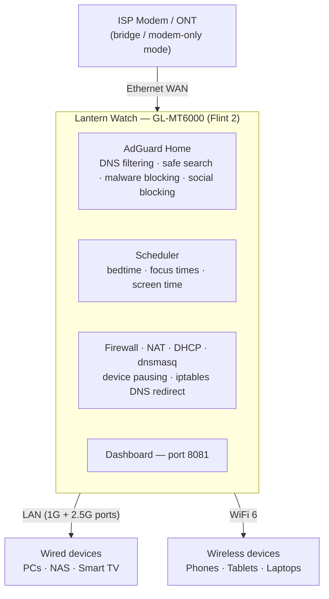
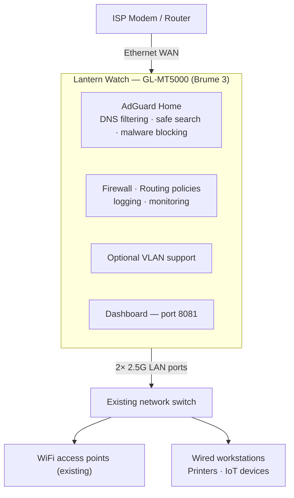

# Lantern Watch

A family network dashboard for GL.iNet routers. Monitor every device on your network, set bedtimes and screen time limits, block social media by profile, and get push notifications when something needs your attention — all from a mobile-friendly web UI.

Built on top of AdGuard Home, which handles the actual DNS blocking. Lantern Watch adds the parental control layer on top.

---

## What you get

- **Device dashboard** — see every device's query count, block rate, and time online today
- **Pause internet** — cut off a device instantly, manually or on a schedule
- **Hours of Peace** — bedtime cutoff that resumes automatically at wake-up time
- **Focus Times** — block internet during homework, chores, or meals
- **Screen time limits** — set a daily hour limit per device; get notified when it's reached
- **Social media profiles** — Open / Moderate / Strict / Custom, applied instantly at the DNS level, plus a secure-by-default **YouTube Restricted Mode** toggle
- **Device roles** — label devices as Personal, Admin, Work Device, Infrastructure, or Smart Device; controls dashboard grouping, whether Pause All applies, and reporting (every role stays fully filtered)
- **Push notifications** — ntfy, Telegram, and Email alerts for blocked content, new devices, high block rates, possible VPN use, and screen time limits
- **Daily and weekly summaries** — sent to your phone at a time you choose
- **Notifications log** — in-dashboard history of every alert sent, with setup guides for each channel
- **Query Log** — live, paginated DNS query viewer; filter by device, time window, domain search, or blocked-only; click any device to drill in; shows friendly device name and IP
- **Router Health card** — live RAM, storage, CPU load, uptime, and DB size in Settings
- **Query history retention** — configurable 7 / 14 / 30 / 60 / 90-day log window (default 60); auto-trims daily with storage-pressure override
- **AdGuard first-run wizard** — adult content filters, malware blocking, and safe search applied in one click during setup
- **Encrypted-DNS bypass protection** — keeps browsers on your filter automatically: it tells Firefox to disable its own DoH (via the standard `use-application-dns.net` canary) and blocks common public DoH providers, with no setup and no breakage. An optional **strict mode** adds DoT (port 853) + resolver-IP firewall blocking for determined bypassers
- **Adult-content blocking on by default** — on **Full** routers a large, actively-maintained local pornography blocklist (HaGeZi NSFW, ~107K sites); on **Lite** routers the same protection comes from a Cloudflare for Families DNS upstream (server-side, so it costs almost no memory). Either way it's on out of the box (see [Protection profiles](#protection-profiles--lite-vs-full-automatic))
- **Smart-TV tracking blocked by default** — stops smart TVs from phoning home about what you watch; optional gambling and extra ad/tracker lists are one tap away in Settings
- **DNS Blocklist manager** — Settings → DNS Blocklists lets you turn any list on or off, grouped by Security / Family & Content / Ads, with each list's rule count and a live "rule budget" meter so you can tune protection vs. load on lighter routers
- **Password recovery** — forgot your password? Request a one-time code sent to your ntfy/Telegram/email
- **Block page with Find Help** — a blocked site lands on a branded Lantern Watch page carrying a prominent **Find Help** link, part of the mission to help anyone struggling find a way out. Plain-HTTP sites show it instantly; HTTPS sites show the browser's certificate warning first, then the page on click-through (HSTS-preloaded sites can't display it, but are still fully blocked either way). The "Blocked Content" notification and the login page also link to Find Help.
- **Find Help** — a curated page of recovery and support resources, reachable any time at `/findhelp` and surfaced right where someone hits a wall
- **Network Notice** — opt-in captive portal: show new devices an acceptable-use notice before granting internet access; Settings toggle shows how many devices have acknowledged and includes a one-click reset; designed for organizations, schools, camps, and families who want explicit consent

---

## Requirements

- A GL.iNet router running OpenWrt (GL-MT6000, GL-MT3600BE, GL-MT5000, GL-MT3000, or GL-MT2500)
- **512 MB RAM minimum — 1 GB+ strongly recommended** (see [Protection profiles](#protection-profiles--lite-vs-full-automatic))
- AdGuard Home enabled in the GL.iNet admin panel
- Python 3 (installed automatically by the setup script)

---

## Protection profiles — Lite vs Full (automatic)

Lantern Watch sizes itself to your router's RAM at install time — one app, no manual choice:

| Profile | RAM | How filtering works |
|---|---|---|
| 🟢 **Full** *(recommended)* | **≥ 600 MB** (1 GB+ ideal) | The complete local blocklists load into AdGuard Home (~300K rules) — adult, malware, ads, trackers, and family categories all filtered **on the router**, with full detail in the query log. |
| 🪶 **Lite** | **< 600 MB** (512 MB travel routers) | Keeps AdGuard Home tiny by moving adult + malware filtering to a **Cloudflare for Families DNS upstream** (server-side, ~zero RAM) instead of loading hundreds of thousands of rules. Only small local family lists (dating, scam, stalkerware) stay on the router. |

**We highly recommend a 1 GB+ router** (Flint 2 or Brume 3) for the full on-device filtering experience and the richest query-log detail. **Lite** exists so Lantern Watch still runs great on 512 MB travel routers like the Beryl 7 — **every parental feature works identically** (schedules, pausing, screen time, social profiles, safe search, notifications, block page). The only difference is *where* adult/malware blocking happens: on the router (Full) vs. at a fast, filtered DNS upstream (Lite). On Lite, blocked sites still land on the Lantern Watch block page.

On the **Lite** profile you can pick the upstream filtering level on the **Social** page — **Malware + Adult** (default) or **Malware only**.

Auto-detection can be overridden at install with `install.sh --force-full` / `--force-lite`.

---

## Recommended routers

Three routers cover almost everyone — pick the one that matches your situation:

| Use case | Recommended hardware | Why |
|---|---|---|
| 🏡 **Home & Office** | 🏆 **[Flint 2 (MT6000)](https://amzn.to/4aq79nj)** | Our recommended router for almost everyone. Fast, reliable, lots of room to grow, and fully tested with Lantern Watch. |
| ✈️ **Travel / Apartment** | **[Beryl 7 (MT3600BE)](https://amzn.to/4wajV1J)** | Compact travel router with excellent performance. Great when portability matters. |
| 🏢 **Business (existing network)** | **[Brume 3 (MT5000)](https://amzn.to/4was7Pt)** | For businesses that already have commercial Wi-Fi or firewall equipment and want Lantern Watch on a dedicated appliance. |

**In 30 seconds:**

- 🥇 **Flint 2** — "Our recommendation for almost everyone."
- ✈️ **Beryl 7** — "For travel, RVs, apartments, and anyone who wants something ultra-portable."
- 🏢 **Brume 3** — "For businesses with an existing router or firewall."

**The details:**

- **Flint 2 (GL-MT6000)** — MediaTek Filogic 830 quad-core @ **2.0 GHz**, **1 GB DDR4 RAM, 8 GB** eMMC storage, 1x 2.5G WAN + 1x 2.5G LAN + 4x 1G LAN, Wi-Fi 6. The extra RAM and storage headroom let it handle large AdGuard filter lists, long query logs, and busy households without breaking a sweat. The recommended pick for a family home or office.
- **Beryl 7 (GL-MT3600BE)** — MediaTek quad-core @ **2.0 GHz**, **512 MB DDR4 RAM, 512 MB** NAND storage, 2x 2.5G ports, Wi-Fi 7. Pocket-sized and travel-friendly with fast modern Wi-Fi — ideal for apartments, RVs, and second locations. With 512 MB RAM it runs the automatic **Lite** profile (adult/malware filtering moves to a Cloudflare for Families DNS upstream to stay light) — see [Protection profiles](#protection-profiles--lite-vs-full-automatic).
- **Brume 3 (GL-MT5000)** — MediaTek quad-core @ **2.0 GHz**, **1 GB DDR4 RAM, 8 GB** eMMC storage, 1x 2.5G + 2x 1G ports, no Wi-Fi. Sits between your modem and your existing Wi-Fi router or firewall — your current network stays exactly as it is, and Lantern Watch protection applies to everything instantly. Fanless, silent, and built for 24/7 always-on use.

All three run OpenWrt with AdGuard Home and are fully supported. Lantern Watch itself is lightweight (Python 3 standard library + SQLite, no external dependencies) — router specs mainly affect AdGuard Home performance under heavy DNS load.

> *These are affiliate links. If you purchase through them we earn a small commission at no extra cost to you — it helps keep Lantern Watch free for every family.*

---

## Architecture

### Family home deployment

> Plug Lantern Watch in front of your network — connect and you're protected.

The GL-MT6000 replaces your existing router. The ISP modem drops into bridge / modem-only mode and every device on your network gets DNS filtering, parental controls, and the dashboard automatically.



---

### Business / edge deployment

> Insert Lantern Watch between your ISP and your existing network.

> **Status: future / experimental — not yet deployed.**

The GL-MT5000 (Brume 3) slots in between the ISP device and an existing network switch. It does not replace any WiFi infrastructure — access points and managed switches stay in place. Wired-only, fanless, and built for 24/7 always-on use.



The **Network Notice** feature (Settings → Network Notice) is designed for this deployment: require every new device to acknowledge an acceptable-use policy before browsing. Once acknowledged, the device browses normally. Acknowledgments persist until an admin resets them.

Full diagram source files: [`docs/architecture/`](docs/architecture/)

---

## Install

### Recommended — install from the GL.iNet panel (no SSH, no file downloads)

Lantern Watch installs from a hosted software source. AdGuard Home is turned on and configured for you automatically — you don't touch any AdGuard settings.

**Before you start:** make sure the router is connected to the internet (it downloads Python and filter lists during setup).

1. In the GL.iNet admin panel, go to **Applications → Plug-ins → Manage Sources**.
2. Add a source — **Name:** `lanternwatch`  ·  **URL:** `https://lanternwatch.org/repo` — click the **＋** button, then **Apply**.
   > The Name must be a single word (no spaces).
3. Click **Refresh**, type **`lanternwatch`** in the filter box, and click **Install** on the Lantern Watch row. Give it about two minutes on a fresh router.
4. Open **http://192.168.8.1:8081** — it takes you straight to a **"set your password"** screen. Choose a username and password and you're in.

That's the whole thing: the installer enables AdGuard Home, wires up DNS routing, applies recommended protection, and starts everything. No temporary password, no AdGuard toggles.

---

### Advanced — script installer (SSH)

For developers, or to install directly from source.

**1. SSH into your router**

```bash
ssh root@192.168.8.1
```

**2. Download and run the installer**

```bash
wget -O /tmp/install.sh https://raw.githubusercontent.com/LanternWatchApp/lantern-watch/main/install.sh
sh /tmp/install.sh
```

The installer detects your router model, installs Python 3, enables and configures AdGuard Home and dnsmasq, sets private **encrypted DNS upstreams** (DoH to Cloudflare + Quad9, so your ISP can't see your lookups), registers the auto-start service, and launches everything. On fresh hardware (Python download) expect about 2 minutes; reinstalls finish in under 30 seconds.

**3. Open the dashboard and set your password**

Go to **http://192.168.8.1:8081** — on a fresh install it takes you straight to **"set your password"**.

> Recovery: the installer also prints a one-time `admin` password in its output. You normally won't need it — it's just a fallback for reaching the login screen directly.

---

## First-run wizard

The wizard runs once on a fresh install. It has three steps:

### Step 1 — Secure your dashboard

Choose a username and password. The temporary password from the install script won't work after you save.

### Step 2 — Protect your family

One click applies everything your network needs to be safe:

- Adult and explicit content blocked
- Malware and phishing sites blocked
- Safe search enabled on Google, Bing, and YouTube
- Deceptive ads and trackers blocked

This is non-destructive — if you already have lists configured in AdGuard, they are left untouched. Only new items are added.

If AdGuard isn't reachable during this step, you can skip it and apply the settings later from **Settings → AdGuard → Apply Now**.

### Step 3 — Set up notifications

Choose how you want to receive alerts — ntfy (easiest, free), Telegram, or email. You can configure these later in Settings if you prefer to skip for now.

---

## Setting up a device schedule

1. On the dashboard, find the device and tap **Schedule**
2. Enable **Hours of Peace** and set a bedtime and wake time
3. Optionally add up to 3 **Focus Times** (homework, dinner, etc.)
4. Optionally enable a **Screen Time** daily limit and reset time
5. Save — takes effect immediately

The dashboard card for that device will show a progress bar when a screen time limit is set. You'll get a notification when the limit is reached.

---

## Social media profiles

Go to **Social** in the top nav. Choose a profile:

| Profile | What it does |
|---|---|
| Open | All platforms allowed |
| Moderate | All allowed — adult content blocked separately by AdGuard |
| Strict | All 10 platforms blocked |
| Custom | Choose exactly which platforms are allowed |

Changes apply instantly to every device on the network. A separate **YouTube Restricted Mode** toggle (secure by default) hides mature videos and comments; turn it off to allow comments, with a clear warning.

---

## Device roles

Go to **Devices** in the top nav to label every device and set its role. **All roles receive the same AdGuard filtering** — the role only affects grouping, whether **Pause All Personal** applies, reporting, and a few alert behaviors.

| Role | Shown in | Pause All | In reports | Notes |
|---|---|:---:|:---:|---|
| 👤 Personal | Devices | ✅ | ✅ | Phones, tablets & laptops used by family members (adults or kids) — the target of Pause All and schedules |
| 🛡️ Admin | Devices | — | ✅ | Same filtering as Personal, but never bulk-paused |
| 💼 Work Device | Devices | — | ✅ | Filtered like any device; auto-exempt from the "activity drop / possible VPN" alert |
| 🖥️ Infrastructure | Infrastructure | — | Skipped | Routers, NAS, printers, servers |
| 📡 Smart Device | Infrastructure | — | ✅ | TVs, cameras, doorbells, thermostats, cars |

**Work Device** is for a laptop or phone that lives on a corporate VPN and does heavy video conferencing. It's filtered exactly like every other device — setting this role does **not** disable any blocking. What it does do is keep the device out of the "Pause All Personal" action and automatically exempt it from the "activity drop / possible VPN" alert (a VPN legitimately makes a device go quiet from the router's view, so that alert would otherwise fire constantly).

---

## Push notifications

Lantern Watch supports three notification channels — configure any or all of them in **Settings**. Each channel has its own **Send Test** button so you can confirm it's working.

You'll receive alerts for:
- **Blocked content attempted** — when someone tries to reach a site you block (adult, dating, social, a category pack, or your own custom blocks). Grouped, with a Find Help link, and rate-limited per site/device so you're never spammed. Everyday ad and tracker blocking stays quiet in the background.
- New device joined the network
- A device has an unusually high block rate
- A device went quiet (possible VPN use)
- Screen time limit reached
- Daily and weekly summaries

---

### ntfy (free push notifications)

[ntfy](https://ntfy.sh) delivers instant push notifications to any phone or desktop with no account required.

1. Install the ntfy app on your phone — iOS, Android, or desktop at **ntfy.sh**
2. Subscribe to a topic name you choose (e.g. `my-family-alerts`)
3. In Lantern Watch go to **Settings → ntfy Primary Topic** and enter that topic name
4. Tap **Send Test Push** to confirm

---

### Telegram

Receive alerts as Telegram messages. Supports personal chats and group chats so multiple family members can all receive alerts.

> **🔒 Lock down your Telegram privacy first.** By default Telegram lets strangers find you by your phone number and add you to groups — that's a Telegram setting, not Lantern Watch (the bot can't see or share your contacts). Before you start, open Telegram → **Settings → Privacy & Security** and set:
> - **Phone Number** → *Who can find me by my number* → **My Contacts** (or Nobody)
> - **Who can add me to groups** → **My Contacts**  *(stops random group spam)*
> - **Last Seen**, **Profile Photo**, **Calls**, **Messages** → **My Contacts**
> - **Data Settings** → turn **off Sync Contacts**, then **Delete Synced Contacts**
> - Leave **People Nearby** off, and you can skip setting a public @username
>
> Lantern Watch only needs your **Chat ID** — never a username — so you can stay unsearchable.

#### Step 1 — Create your bot

1. Open Telegram and search for **@BotFather**
2. Send `/newbot`
3. Choose a name (e.g. *"Lantern Watch Alerts"*) and a username ending in `_bot` (e.g. *LanternWatchFamily_bot*)
4. BotFather will give you a **Bot Token** — copy and save it

#### Step 2 — Get your Chat ID (personal alerts)

1. Search for your new bot in Telegram and tap **Start**
2. Send it any message (e.g. *"hello"*)
3. Open this URL in your browser (replace `TOKEN` with your bot token):
   ```
   https://api.telegram.org/botTOKEN/getUpdates
   ```
4. Look for `"chat":{"id":` — that number is your **Chat ID**
5. In Lantern Watch go to **Settings → Telegram**, enter your Bot Token and Chat ID, then tap **Save**
6. Tap **Send Test Message** to confirm

#### Step 3 — Group alerts (optional — send to multiple people)

1. Create a new Telegram group (e.g. *"Family Alerts"*)
2. Add the other parents to the group
3. Add your Lantern Watch bot to the group by searching its username
4. Send any message in the group (e.g. *"test"*)
5. Open the same getUpdates URL in your browser
6. Look for `"chat":{"id":` — the group Chat ID will be a **negative number** like `-1001234567890`
7. Replace the Chat ID in Settings with this negative number and tap **Save**

> Other parents just download Telegram and accept the group invite — they receive all alerts automatically with no setup required.

---

### Email

Receive alerts by email. Works with Gmail, Outlook, iCloud Mail, and any SMTP provider. Just fill in your credentials and tap **Save** — no enable toggle required.

**Gmail setup:**
1. Make sure **2-Step Verification** is on, then go directly to **[myaccount.google.com/apppasswords](https://myaccount.google.com/apppasswords)** (App Passwords only appear once 2-Step Verification is enabled).
2. Create a new app password (name it "Lantern Watch") — Google gives you a **16-character code**
3. In Lantern Watch **Settings → Email**, enter:
   - **Send Alerts To:** your email address
   - **SMTP Host:** `smtp.gmail.com`
   - **Port:** `587`
   - **From Address:** your Gmail address
   - **App Password:** the 16-character app password from step 2
4. Tap **Save**, then **Send Test Email** to confirm

**Outlook/Hotmail:** Use `smtp-mail.outlook.com`, port `587`, and your regular account password (or an app password if you have 2FA enabled).

---

## Notifications log

Go to **Notifications** in the top nav to see a full history of every alert sent — blocked content, new devices, screen time limits, and more. The page also has step-by-step setup guides for all three notification channels.

---

## Router Health

Go to **Settings → Router Health** to see a live snapshot of your router's resources:

- **RAM** — used vs total with a colour bar (green → amber → red)
- **Storage** — flash usage and free space
- **CPU load** — 1-minute average
- **Uptime** — how long the router has been running
- **DB size** — how large the Lantern Watch query log has grown
- **USB** — detected if a drive is mounted at `/mnt/sda1` or `/mnt/usb`

---

## Query history retention

Go to **Settings → Query History** to choose how many days of DNS traffic Lantern Watch keeps: **7**, **14**, **30**, **60** (default), or **90** days. Old records are deleted automatically once per day.

If flash storage exceeds 80% full, the retention window is automatically reduced to 7 days regardless of your setting to protect the router from running out of space.

---

## For developers

### Brand colour

The Lantern Watch brand colour is **`#e8a000`** (orange). Always use this exact value — whether applying colour in CSS, rendering the logo in a new context, or adding any new UI elements that use the brand colour. Do not substitute approximations like `orange`, `#f90`, or any other shade.

### Tech stack

| Layer | What it is |
|---|---|
| HTTP server | Python 3 `ThreadingHTTPServer` — no framework |
| Templating | Plain f-strings in `pages.py` — no Jinja, no React |
| Database | SQLite via `sqlite3` stdlib |
| DNS filtering | AdGuard Home REST API (`/control/` prefix on GL.iNet builds) |
| Social blocking | AdGuard Home custom filter rules (`\|\|domain^`) via AGH API |
| Notifications | ntfy, Telegram Bot API, SMTP — all stdlib `urllib` |

### File structure

| File | Purpose |
|---|---|
| `dashboard.py` | Entry point — starts the HTTP server |
| `routes.py` | All GET and POST route handlers |
| `pages.py` | Every page rendered as an HTML string |
| `adguard.py` | AdGuard Home API wrapper, social profile logic, per-client filtering |
| `db.py` | SQLite helpers, screen time calculations, stats queries |
| `collector.py` | Background poller — reads AdGuard querylog every 30s into SQLite, paginating so busy networks don't lose entries |
| `alerts.py` | Notification sending (ntfy, Telegram, email) and alert logic |
| `scheduler.py` | Bedtime, focus time, and screen time enforcement loop |
| `config.py` | Config load/save helpers and default values |
| `recovery.py` | In-memory OTP password recovery |
| `portal.py` | Captive portal — iptables `lw_captive` chain management, per-IP acknowledgment tracking |
| `lantern_watch_logo.svg` | Full brand logo — inlined as SVG on the login and block pages |
| `lantern_logo.svg` | Lantern icon — used in the dashboard header |
| `lanternwatch_config.example.json` | Template for the live config (never committed) |
| `setup_router.sh` | One-command install script for the router |
| `lanternwatch.initd` | OpenWrt init.d service file |

### Development workflow

The app runs on the router, not a desktop. The typical workflow is:

1. Edit files on your dev machine
2. Copy the changed files to the router and restart:
```bash
scp -O -i ~/.ssh/id_ed25519 pages.py routes.py root@192.168.8.1:/root/lantern-watch/
ssh -i ~/.ssh/id_ed25519 root@192.168.8.1 "/etc/init.d/lanternwatch restart"
```

> `scp` needs `-O` — OpenWrt has no sftp-server. Don't try `git pull` on the router:
> a package install has no git checkout, and the router holds no credentials.

Use the router's **actual LAN IP**. It is usually `192.168.8.1`, but GL.iNet shifts
the LAN subnet automatically when a router runs behind another one (a travel
router in repeater mode typically lands on `192.168.10.1`). Check with
`uci get network.lan.ipaddr`.

The dashboard is then live at **http://&lt;router-lan-ip&gt;:8081**.

### Configuration

Copy `lanternwatch_config.example.json` to `lanternwatch_config.json` on the router and fill in your AdGuard credentials. This file is in `.gitignore` and must never be committed — it holds live credentials.

---

## Updating

**From the GL.iNet panel (easiest):** go to **Applications → Plug-ins**, click **Refresh**, search **`lanternwatch`**, and click **Update** (it appears once the hosted source has a newer version). The installer runs automatically and preserves your config.

**From the dashboard:** Settings → **Update Now** downloads and installs the latest release in place and restarts. Your devices, names, and settings are preserved.

**Direct `.ipk` (SSH or LuCI Software):**

```bash
wget -O /tmp/lw.ipk https://lanternwatch.org/repo/lanternwatch_<version>_all.ipk
opkg install /tmp/lw.ipk
```

---

## Changelog

See [CHANGELOG.md](CHANGELOG.md) for the full release history.

---

## GL.iNet firmware upgrades

The installer disables GL.iNet auto-upgrade (so a silent OTA update can't wipe the router unattended) and registers the Lantern Watch paths in `/etc/sysupgrade.conf`. As a result, a **"Keep Settings" firmware upgrade now preserves** the app files, `lanternwatch_config.json`, and the SQLite history automatically. You may still need to re-enable autostart afterward (`/etc/init.d/lanternwatch enable`) and reinstall Python 3 if the upgrade removed it.

A **full reset / "don't keep settings" upgrade** still wipes everything in `/root/` — including the Lantern Watch app files, `lanternwatch_config.json`, and the Python 3 installation, and clears the init.d service registration. AdGuard Home survives (it's managed by GL.iNet separately), but in that case Lantern Watch needs to be fully reinstalled using the steps below.

**Before upgrading GL.iNet firmware, back up these two files from the router:**

```bash
# Run from your Windows machine
scp -O -i C:\Users\YOUR_USERNAME\.ssh\id_ed25519 root@192.168.8.1:/root/lantern-watch/lanternwatch_config.json ./lanternwatch_config.json.backup
scp -O -i C:\Users\YOUR_USERNAME\.ssh\id_ed25519 root@192.168.8.1:/etc/AdGuardHome/config.yaml ./AdGuardHome_config.yaml.backup
```

**After the firmware upgrade, redeploy Lantern Watch:**

```bash
# 1. Reinstall Python 3
ssh root@192.168.8.1 "opkg update && opkg install python3"

# 2. Recreate the app directory and copy all files
ssh root@192.168.8.1 "mkdir -p /root/lantern-watch"
# SCP all .py files and SVG assets back to /root/lantern-watch/

# 3. Restore your config
scp -O -i C:\Users\YOUR_USERNAME\.ssh\id_ed25519 lanternwatch_config.json.backup root@192.168.8.1:/root/lantern-watch/lanternwatch_config.json

# 4. Reinstall and start the service
scp -O -i C:\Users\YOUR_USERNAME\.ssh\id_ed25519 lanternwatch.initd root@192.168.8.1:/etc/init.d/lanternwatch
ssh root@192.168.8.1 "chmod +x /etc/init.d/lanternwatch && /etc/init.d/lanternwatch enable && /etc/init.d/lanternwatch start"
```

After recovery, verify everything is running:

```bash
ssh root@192.168.8.1 "/etc/init.d/lanternwatch status && ps w | grep python | grep -v grep"
```

---

## GL.iNet built-in Parental Controls

GL.iNet firmware v4.9.0 introduced a built-in Parental Controls feature. **This is completely separate from Lantern Watch and AdGuard Home — do not use both at the same time.**

Lantern Watch manages all parental controls directly through AdGuard Home (DNS-level blocking, schedules, screen time, social profiles). GL.iNet's built-in parental controls are a different system and will conflict.

Additionally, GL.iNet's built-in parental controls are disabled when Network Acceleration is active — which is the default on most GL.iNet routers. Lantern Watch has no such limitation.

---

## Performance and speed

Enabling AdGuard Home on a GL.iNet router reduces maximum throughput compared to running without it. This is a known trade-off on all GL.iNet routers: AdGuard requires DNS interception rules that disable hardware NAT offloading, so all traffic is processed in software instead.

Typical throughput with AdGuard enabled:
- GL-MT6000 Flint 2 / GL-MT5000 Brume 3 — 800–950 Mbps (same quad-core processor; Brume 3 is wired-only with 2.5G ports)
- GL-MT3600BE Beryl 7 — 600–900 Mbps (Wi-Fi 7; keep filter lists moderate on 512 MB RAM)
- GL-MT3000 Beryl AX3000 — 400–700 Mbps

If your speeds are significantly lower than these, the most common cause is too many AdGuard filter lists loaded at once. On the **Full** profile the wizard installs a balanced set (~300K rules); the **Lite** profile keeps the local set tiny automatically and offloads adult/malware filtering to a DNS upstream (see [Protection profiles](#protection-profiles--lite-vs-full-automatic)). Avoid adding very large lists — anything over 500K rules is heavy for home router hardware and can cause AdGuard to crash and restart under memory pressure.

To check your current filter list rule count go to **http://192.168.8.1:3000 → Filters → DNS Blocklists**.

---

## Troubleshooting

**Can't SSH into the router during install**

GL.iNet routers block SSH on the WAN interface by default. If you are installing Lantern Watch on a second router that sits behind your main router (e.g. a Beryl AX behind a Flint 2), SSH to its upstream LAN IP will be rejected. Fix: connect directly to the router's own WiFi or LAN port for the install, or enable remote SSH access in the GL.iNet admin panel under **System → Security → SSH**.

**SSH key auth not working on Beryl AX (GL-MT3000)**

The MT3000 uses Dropbear, which reads authorized keys from `/etc/dropbear/authorized_keys` — not the standard `/root/.ssh/authorized_keys`. Copy your public key there:
```bash
ssh root@192.168.8.1 "mkdir -p /etc/dropbear && cat >> /etc/dropbear/authorized_keys" < ~/.ssh/id_ed25519.pub
```

**AdGuard stats showing 0 / collector can't connect after fresh install**

Re-run the installer — it will detect the missing service account and add it without changing anything else:
```bash
sh /tmp/install.sh --skip-clone
```

**Dashboard not loading**
```bash
/etc/init.d/lanternwatch status
/etc/init.d/lanternwatch start
```

**AdGuard not blocking**

The installer normally handles all of this, so check the dashboard home page first — it shows a red **"DNS misconfiguration detected"** banner if the DNS chain is wrong. That banner means AdGuard Home is answering on port **53** directly instead of letting **dnsmasq** own it (dnsmasq must own port 53 and forward to AdGuard on 3053 — that's what preserves per-device tracking). The fix: in the GL.iNet panel's **AdGuard Home** page turn **off "Handle Client Requests"**, then restart the router so dnsmasq reclaims port 53.

**Only one device appearing on the dashboard (all others missing)**

This happens when AdGuard Home is receiving DNS queries proxied through dnsmasq instead of directly from each device — so every query appears to come from `127.0.0.1`. Root cause: `adguardhome.config.dns_enabled` is set to `'0'`.

Fix via SSH:
```bash
uci set adguardhome.config.dns_enabled='1'
uci commit adguardhome
/etc/firewall.dns_order
```

This sets up iptables rules that redirect port-53 DNS traffic directly to AdGuard with the original device IP preserved. Restarting Lantern Watch after the fix will start showing all devices as they make DNS queries. Active DHCP devices appear immediately.

This issue is most commonly seen after a `.ipk` package install on the Brume 3 (GL-MT5000) — install.sh applies the fix automatically, but if you installed via the GL.iNet package manager the step may not have run. Verify with: `uci get adguardhome.config.dns_enabled` (should return `1`).

**Devices not appearing on the dashboard**

AdGuard Home needs to be running and handling DNS for at least a few minutes before devices show up. Check **http://192.168.8.1:3000** to confirm it's active.

**Forgot dashboard password**

Click **Forgot password?** on the login page. A one-time 6-digit code will be sent to your configured notification channels (ntfy, Telegram, or email). Enter the code, then set a new password. The code expires in 10 minutes.

If no notification channels are configured, SSH into the router and reset manually:
```bash
cd /root/lantern-watch
python3 -c "
import json,secrets,string
c=json.load(open('lanternwatch_config.json'))
pw=''.join(secrets.choice(string.ascii_letters+string.digits) for _ in range(12))
c['lw_password']=pw
c['first_run']=True
json.dump(c,open('lanternwatch_config.json','w'),indent=2)
print('Temporary password: '+pw)
"
/etc/init.d/lanternwatch restart
```
Use the printed temporary password to log in, then set a new password in the wizard.

**Telegram test fails with "Unauthorized"**

Your Bot Token is incorrect. Double-check it in @BotFather → `/mybots`.

**Telegram test fails with "Bad Request: chat not found"**

Your Chat ID is incorrect, or you haven't sent the bot a message yet (Step 2 above). For group IDs make sure the number is negative.

**Email test fails with "Authentication failed"**

For Gmail, make sure you're using an **App Password** (not your regular Gmail password). App Passwords are created in Google Account → Security → 2-Step Verification → App Passwords.

**Email test fails with "Connection refused" or times out**

Check that your SMTP host and port are correct. Gmail uses `smtp.gmail.com:587`. Outlook uses `smtp-mail.outlook.com:587`.

**Notifications not arriving even though test works**

The alerts background process may have restarted. Check it is running:
```bash
/etc/init.d/lanternwatch status
```

**Protection settings not applied after first-run skip**

Go to **Settings → AdGuard** — you'll see an orange warning banner with an **Apply Now** button. Click it to apply all recommended protection settings.

**YouTube loads but videos won't play**

A filter list is blocking `googlevideo.com`, which is YouTube's video streaming CDN. To fix it, SSH into the router and run:
```bash
cd /root/lantern-watch
python3 -c "import json; from adguard import add_allowlist_domain; c=json.load(open('lanternwatch_config.json')); add_allowlist_domain(c, 'googlevideo.com'); print('Done')"
```
This adds a permanent exception without removing any filter lists.

**Blocked social media sites still loading after profile change**

DNS results are cached on each device. After changing a social profile, wait 1–2 minutes or try the site in an incognito/private window on a device that hasn't visited it recently.

**AdGuard crashing or restarting repeatedly**

Check your filter list total at **http://192.168.8.1:3000 → Filters → DNS Blocklists**. If the total rule count is above 1.5 million the router is likely running out of memory. Remove the largest lists until you are under 500K rules total. The Beryl AX3000 should be kept under 400K.

---

## Supporting the project

Lantern Watch is free for everyone — families, churches, camps, organizations — forever. No subscriptions, no licenses, no catch.

If Lantern Watch is protecting your family, consider leaving a tip to help put a router in a home that can't afford one. 100% of tips go toward putting fully-loaded routers into homes that need them and supporting continued development.

[Buy me a coffee](https://buymeacoffee.com/lanternwatch) · [lanternwatch.org](https://lanternwatch.org)

No pressure. The software stays free either way.

---

## Legal

Lantern Watch is released under the [MIT License](LICENSE) — free to use, modify, and distribute. The software is provided as-is with no warranty. See [Terms of Use](docs/legal/terms.md) and [Privacy Policy](docs/legal/privacy.md) for full details.

Want to contribute? See [CONTRIBUTING.md](CONTRIBUTING.md).
