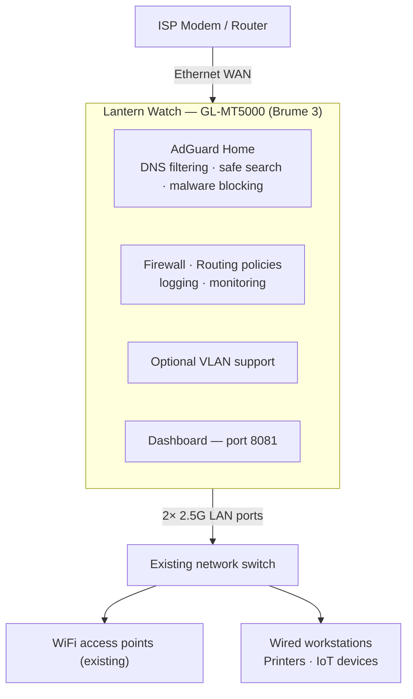

# Business / Edge Deployment

> **Status: future / experimental — not yet deployed.**

> Insert Lantern Watch between your ISP and your existing network.

The GL-MT5000 (Brume 3) slots in between the ISP device and an existing internal switch. It does not replace any WiFi infrastructure — access points, managed switches, and VLAN setups are left in place. The Brume 3 adds DNS filtering, firewall policies, and the monitoring dashboard at the network edge.

The Brume 3 has no built-in WiFi. It is fanless and built for 24/7 always-on use at the edge. Existing access points, switches, and any managed VLAN setup continue to operate unchanged.

No remote access component. All protection runs locally on the device.
