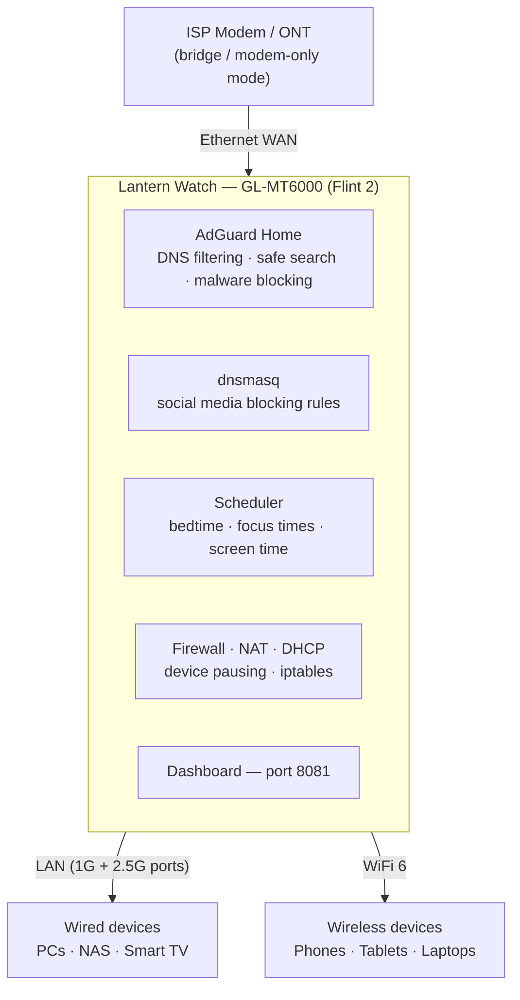

# Family Home Deployment

> Plug Lantern Watch in front of your network — connect and you're protected.

The GL-MT6000 replaces your existing router. The ISP modem drops into bridge / modem-only mode. Every device on your network flows through Lantern Watch and gets DNS filtering, parental controls, and the monitoring dashboard automatically.

**DNS chain:** devices → dnsmasq :53 (social blocking rules) → AdGuard Home :3053 (DNS filtering) → upstream DNS.

No remote access component. All protection runs locally on the router. Nothing phones home.
